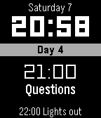

# vipassana-pebble
Pebble watchface showing Vipassana 10 day time table.

Built with [rocky.js](https://developer.rebble.io/developer.pebble.com/tutorials/js-watchface-tutorial/part1/index.html).

# Prepare

Pebble has been deprecated and the resources for setting up a build environment are not complete.

These resources should help:

* https://developer.rebble.io/developer.pebble.com/sdk/download/index.html

If on Windows, use WSL and install Ubuntu from Microsoft Store. Then follow instructions for Linux (64-bit).

This resource was usefull for solving errors during SDK installation:

* https://gist.github.com/zeevro/ce20d0d74a869d73119e9d1522b7caa7

# Configure
Update **courses** in `src/rocky/index.js` with the first date (day 0) of courses.

# Build

`pebble build`

# Install

`pebble install --phone <ip> --logs`
